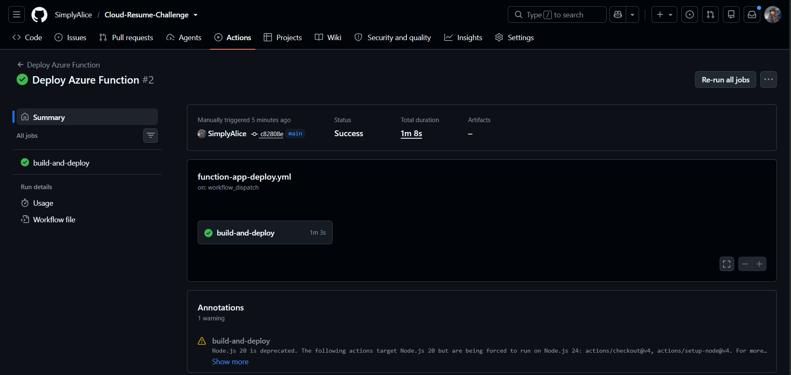
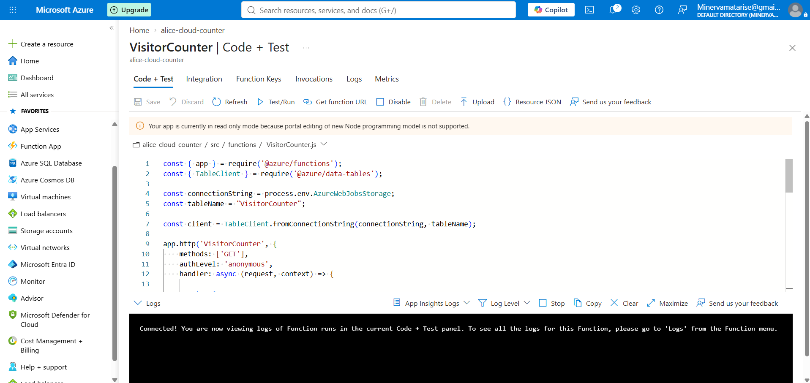
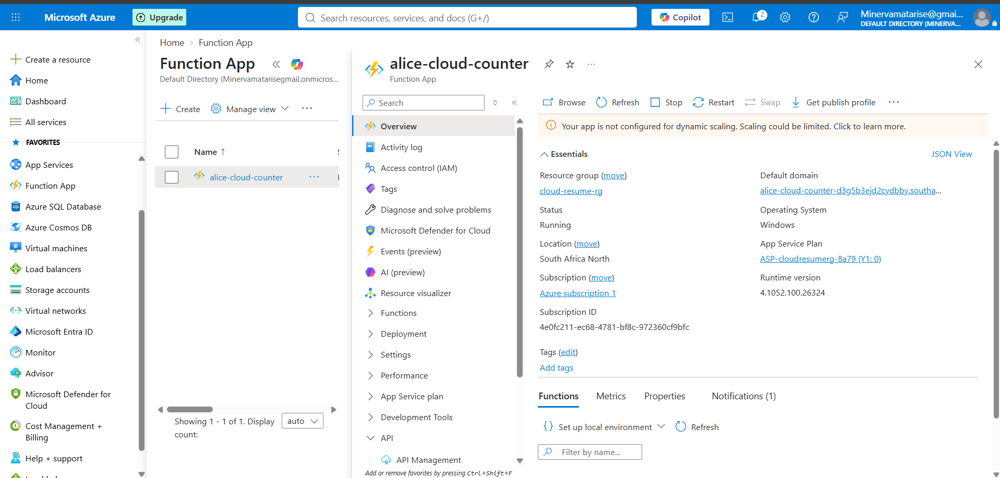
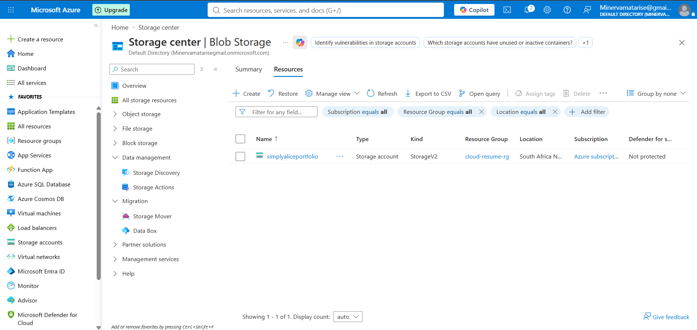
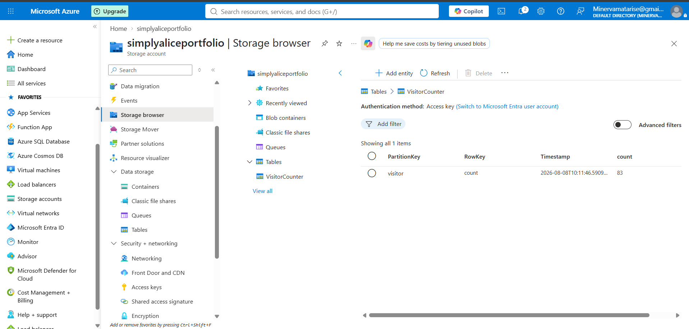
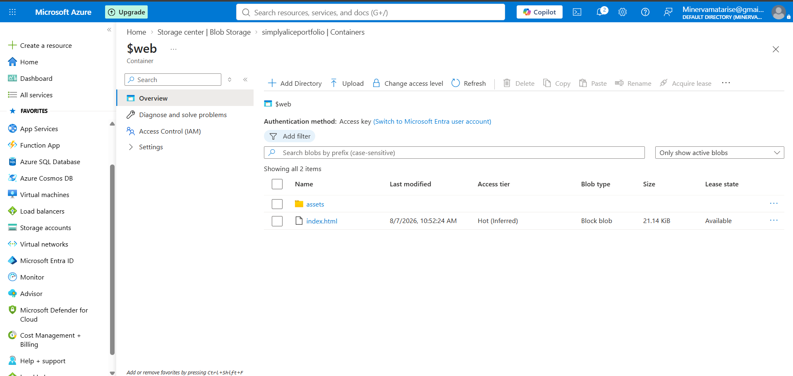

# 📸 Project Screenshots

Screenshots documenting the Azure infrastructure and deployment pipelines are available in:

`assets/images/screenshots/`

### GitHub Actions — Static Website Deployment

### GitHub Actions — Azure Function Deployment

### Azure Function

### Azure Function App

### Azure Storage Account

### Azure Table Storage

### Azure Static Website

