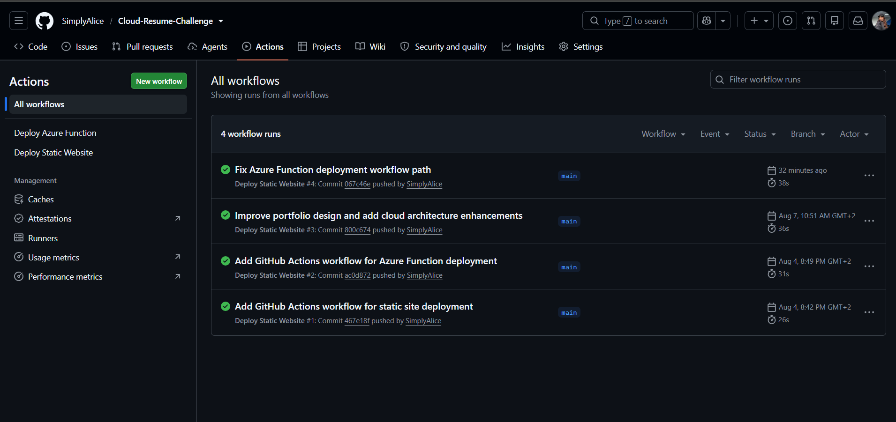

# Cloud Resume Challenge — Alice Matarise

A cloud-hosted portfolio website built as part of the Cloud Resume Challenge, demonstrating practical experience with Microsoft Azure, serverless computing, cloud storage, JavaScript, and CI/CD automation.

## 🌐 Live Demo

**Portfolio:**
https://simplyaliceportfolio.z1.web.core.windows.net/

The portfolio is hosted using Azure Storage Static Website Hosting and includes a serverless visitor counter powered by Azure Functions and Azure Table Storage.

---

## 📌 Project Overview

The Cloud Resume Challenge is a hands-on cloud engineering project designed to demonstrate practical knowledge of cloud infrastructure, serverless architecture, APIs, storage, automation, and continuous deployment.

For this project, I built and deployed a personal cloud portfolio that showcases my software engineering background, cloud engineering interests, projects, education, and certification journey.

The website is not simply a static portfolio. It uses Azure services to provide a functional backend and automated deployment pipeline.

### Key features

* Responsive personal portfolio website
* Azure Static Website Hosting
* Serverless visitor counter
* Azure Function API
* Azure Table Storage
* JavaScript frontend integration with the API
* GitHub Actions CI/CD
* Automated static website deployment
* Automated Azure Function deployment
* Downloadable CV
* GitHub and LinkedIn integration
* Cloud architecture documentation

---

# ☁️ Cloud Architecture

The application follows a simple serverless architecture:

```text
                    ┌─────────────────────┐
                    │       Visitor       │
                    │      Web Browser    │
                    └──────────┬──────────┘
                               │
                               ▼
                    ┌─────────────────────┐
                    │   Azure Storage     │
                    │   Static Website    │
                    │                     │
                    │ HTML / CSS / JS     │
                    └──────────┬──────────┘
                               │
                               │ Visitor count request
                               ▼
                    ┌─────────────────────┐
                    │   Azure Functions   │
                    │                     │
                    │   Serverless API    │
                    └──────────┬──────────┘
                               │
                               │ Read / update
                               ▼
                    ┌─────────────────────┐
                    │ Azure Table Storage │
                    │                     │
                    │  Visitor Counter    │
                    └─────────────────────┘
```

### Request flow

1. A visitor opens the portfolio website.
2. Azure Storage serves the static HTML, CSS, and JavaScript files.
3. JavaScript sends a request to the Azure Function API.
4. The Azure Function processes the visitor request.
5. The visitor count is stored and retrieved from Azure Table Storage.
6. The updated visitor count is returned to the website.
7. The visitor count displayed on the portfolio is updated.

---

# ☁️ Azure Services

## Azure Storage Account

Azure Storage provides the static website hosting environment for the portfolio.

The website's frontend files are hosted in Azure Storage and served directly to visitors.

**Used for:**

* Static website hosting
* HTML files
* CSS files
* JavaScript files
* Portfolio assets

---

## Azure Functions

Azure Functions provides the serverless backend for the visitor counter.

The function receives requests from the website and handles the visitor count logic without requiring a traditional continuously running server.

**Used for:**

* HTTP API
* Visitor count processing
* Serverless backend logic

---

## Azure Table Storage

Azure Table Storage is used to persist the visitor count.

This allows the counter to retain its value between requests rather than storing the count only inside the browser.

**Used for:**

* Persistent visitor count data
* Reading the current count
* Updating the count when a visitor accesses the website

---

# 🔢 Visitor Counter

The portfolio includes a live visitor counter.

The frontend communicates with the Azure Function API using JavaScript.

The request flow is:

```text
Portfolio
    │
    │ HTTP request
    ▼
Azure Function
    │
    │ Read / update
    ▼
Azure Table Storage
    │
    │ Updated count
    ▼
Azure Function
    │
    │ Response
    ▼
Portfolio
```

The counter updates when the website is loaded or refreshed.

---

# 🔄 CI/CD with GitHub Actions

The project uses GitHub Actions to automate deployment.

Two workflows are configured:

### Static Website Deployment

Changes pushed to the `main` branch trigger the static website deployment workflow.

```text
GitHub Repository
        │
        │ Push to main
        ▼
GitHub Actions
        │
        ▼
Azure Storage
        │
        ▼
Updated Portfolio
```

### Azure Function Deployment

Changes to the `api` directory trigger the Azure Function deployment workflow.

```text
GitHub Repository
        │
        │ API changes
        ▼
GitHub Actions
        │
        ▼
Azure Function
        │
        ▼
Updated API
```

The Azure Function workflow was also tested through a manual GitHub Actions run and successfully deployed the function.

---

# 🛠️ Technologies Used

### Frontend

* HTML5
* CSS3
* JavaScript

### Cloud

* Microsoft Azure
* Azure Storage
* Azure Static Website Hosting
* Azure Functions
* Azure Table Storage

### DevOps

* Git
* GitHub
* GitHub Actions
* CI/CD

### Development Tools

* Visual Studio Code
* Azure CLI

---

# 📸 Project Screenshots

Screenshots documenting the Azure infrastructure and deployment pipelines are available in:

`assets/images/screenshots/`

### GitHub Actions — Static Website Deployment



### GitHub Actions — Azure Function Deployment


### Azure Function


### Azure Function App


### Azure Storage Account


### Azure Table Storage


### Azure Static Website


---

# 📁 Project Structure

```text
Cloud-Resume-Challenge/
│
├── .github/
│   └── workflows/
│       ├── static-site-deploy.yml
│       └── function-app-deploy.yml
│
├── api/
│   ├── host.json
│   ├── package.json
│   └── ...
│
├── assets/
│   ├── css/
│   │   └── styles.css
│   │
│   ├── js/
│   │   └── script.js
│   │
│   ├── images/
│   │
│   └── screenshots/
│
├── index.html
└── README.md
```

---

# 🎓 What I Learned

This project gave me practical experience with cloud engineering concepts beyond simply writing frontend code.

### Cloud

* Deploying a static website to Azure Storage
* Working with Azure resources
* Understanding serverless architecture
* Using Azure Functions as an API backend
* Persisting application data using Azure Table Storage

### Development

* Connecting a JavaScript frontend to a serverless API
* Working with HTTP requests and API responses
* Structuring a cloud-enabled web application
* Debugging deployment and configuration issues

### DevOps

* Managing source code with Git and GitHub
* Creating GitHub Actions workflows
* Automating static website deployments
* Automating Azure Function deployments
* Troubleshooting CI/CD workflow failures

### Problem Solving

One of the challenges during deployment involved correcting the Azure Function GitHub Actions workflow path and resolving deployment authentication issues.

The deployment pipeline was subsequently configured successfully and verified through GitHub Actions.

---

# 🚀 Future Improvements

Potential future improvements include:

* Adding additional Azure services
* Improving monitoring and logging
* Adding automated testing
* Expanding the backend functionality
* Implementing infrastructure as code
* Adding more cloud security controls
* Improving performance and accessibility

---

# 👩🏽‍💻 About Me

I'm Alice Matarise, a final-year BSc Information Technology (Software Engineering) student at Eduvos with an interest in cloud engineering, automation, software development, and modern cloud infrastructure.

I'm currently building practical experience with Microsoft Azure, Python, APIs, DevOps, and serverless technologies while working towards the Microsoft Azure Fundamentals (AZ-900) certification.

### Connect with me

* GitHub: https://github.com/SimplyAlice
* LinkedIn: https://www.linkedin.com/in/alice-matarise-778bb6374/

---

## 📄 License

This project was created as a personal portfolio and learning project.


